# Particle Life
Implementation of Particle Life in Rust using SDL2 for graphics.

The simulation almost works like a normal planet simulation.
The particles attract each other with a force of 1/d² and a small
amount of drag.

The attraction is directional, controlled by a grid of coefficients:  
For example, yellow might attract red, but red might repel yellow and green.
Green could attract both, but repelling other green particles.
Yellow is neutral to green.
A small attractive force exists for red/yellow particles to their own kind.

This might sound like some of these "logic riddles", but it's quite easy to 
understand when expressed in a table like this:

|        | yellow | red | green |
|--------|--------|-----|-------|
| yellow | 0.5    | 1   | 1     |
| red    | -1     | 0.5 | -1    |
| green  | 1      | 1   | -1    |
_0: neutral, 1: column is attracted by row, -1: column is repelled by row_

These simple rules give life to a variety of small creatures, moving around
the toroidal world (a world where top/bottom and left/right are connected).

These values are randomly generated via a seed.

The images in this README use 7 particle types with random coefficients ranging -1 to 1
and a particle count of 5000 in a 800x600 world (same as screen size)

## Run App
`cargo run --release -- <optional seed>`

## Key Binds
- `Up`/`Down` slower/faster tick rate
- `P` toggle following
- `Space` pause/unpause

## Windows specific SDL2 installation info
Unix should be able to install SDL2 more easily

Download each the `*-2.6.2-VC.zip` from
[SDL](https://github.com/libsdl-org/SDL/releases/tag/release-2.26.2) and
[SDL_ttf](https://github.com/libsdl-org/SDL_ttf)
respectively and add each `lib/x64` to the `LIB` environment variable.

Copy `SDL2.dll` and `SDL2_ttf.dll` into the root of your project (already done).
If necessary replace with a version compatible to your download.

`SDL2_gfx.dll` got acquired from this [Google Drive](https://drive.google.com/drive/folders/14RPWmR-xOE30aUnZnOy0hT9AzZejNkqs) 
`SDL2_gfx.lib` was built manually for windows x64 and is in local files instead of on `PATH` so you don't have to.

## Gallery

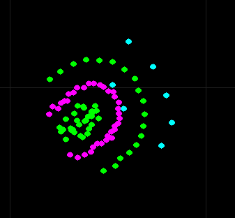
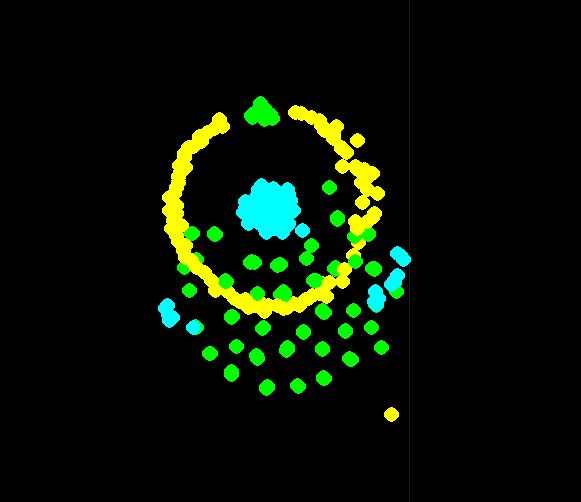
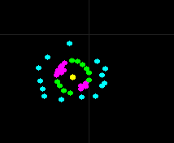
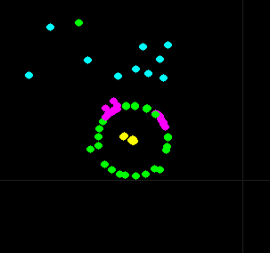
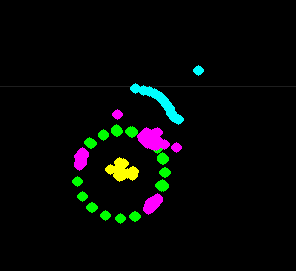
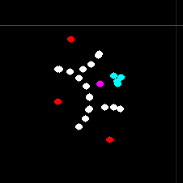
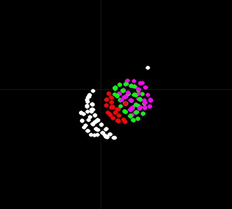
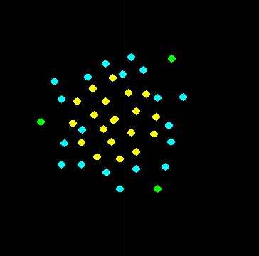
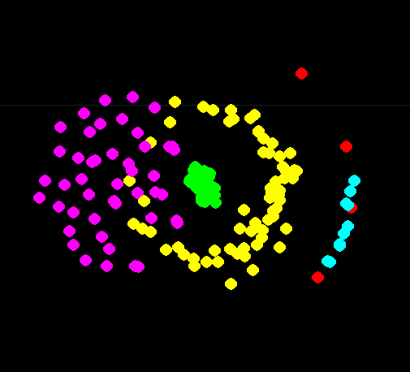
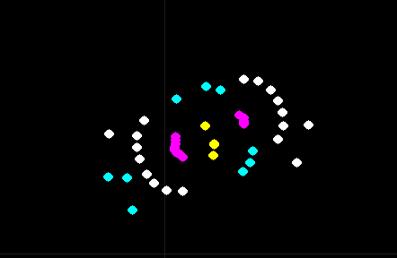
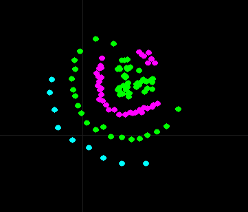
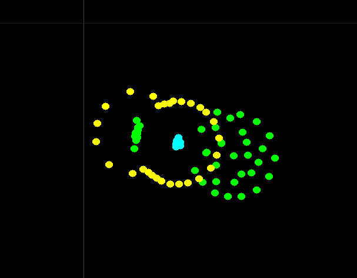